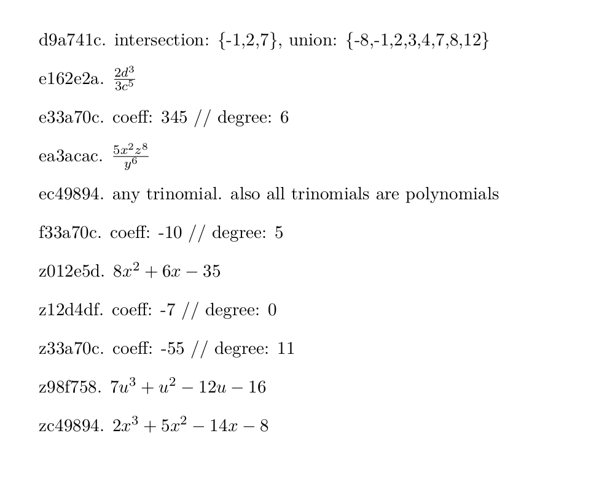

## Where KRS is Known To Work

- Ubuntu 22.04 Jammy
   - with: Python 3.10.12
   - with: `pdflatex -version` as follows:
      - pdfTeX 3.141592653-2.6-1.40.22 (TeX Live 2022/dev/Debian)

At time of writing, no special python packages needed.

Most important external dependency is pdflatex (and LaTeX).

Get these `apt` packages:
- `texlive-latex-base texlive-latex-extra texlive-latex-recommended`

Note: the package `texlive-latex-base` should provide: `/usr/bin/pdflatex`

## Sample Usage

```
cd krs_gensheet/

./krs.py \
    -v inequalities \
    -t identity-or-contradiction \
       solve-for-x \
       sp25_1.5 \
       definitions \
    -- ../inputs/problemset01/sp25*txt

# ^^ Note: use '--' to mark the end of value options and the start of positional args.
```

After running the above, view worksheets with:
```
evince worksheet*pdf
```

View answer keys with:
```
evince answers*pdf
```

## Sample Output

### Worksheets look like


### Answer key pages look like


