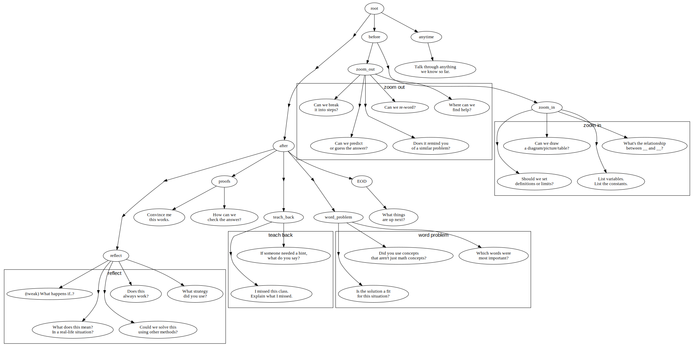

## Math Tutor Ideas

This doesn't really belong in the `krs` repo, but it's also not a problem for it
to live here until I make a better home for it.

### Asking Questions to Encourage Introspection

Recommended:
   - https://web.archive.org/web/20260110201446/https://teaching.uoregon.edu/sites/default/files/2021-09/leading-lab-handouts-2021.pdf

Also:

